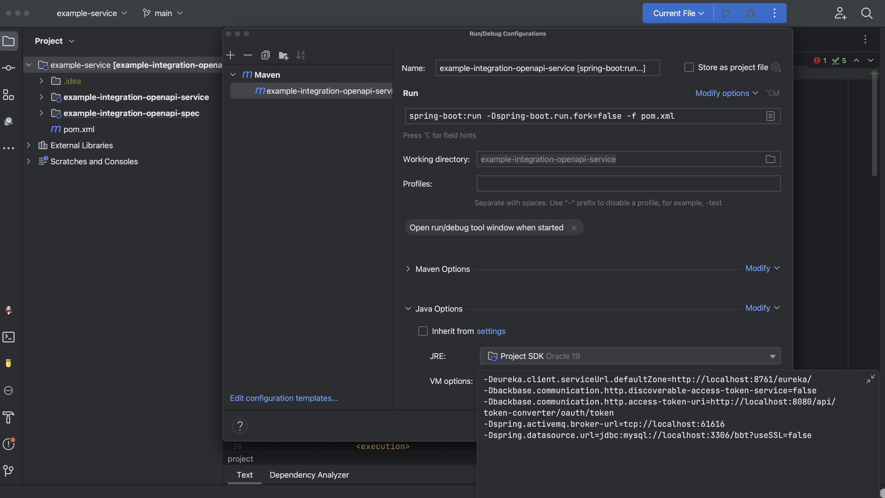
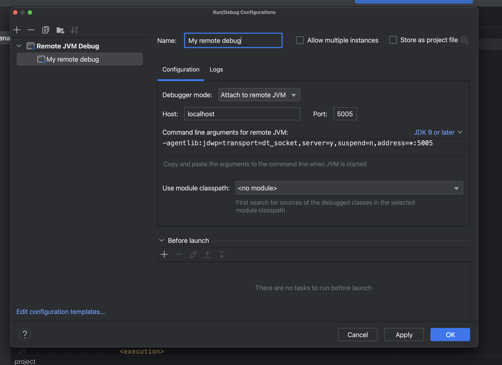

# Setup Backbase Local Environment (docker-compose)

In this guide we'll create a lightweight Backbase setup configuring using docker-compose file.

## Pre-requisites

- Any docker runtime;

> You can use Colima running with Docker and Docker Compose:
```shell
brew install colima docker docker-compose docker-credential-helper
colima start --cpu 4 --memory 16
```

- Backbase Repository Credentials, use your Backbase credentials to login to the Backbase repo:
```shell
docker login repo.backbase.com
```
> If connected to the VPN you can also login to harbor: `docker login harbor.backbase.eu`

## Steps

Once everything is installed and the docker is up and running you can execute the following steps:
- Check all running containers
```shell
docker ps
```
- Check backbase docker registry
```shell
docker pull repo.backbase.com/backbase-docker-releases/edge:2022.09.1
```
- Inside docker-compose directory run to the following to start up the env.
```shell
docker compose up -d
```

> The profile `boostrap` is required for the first execution (to ingest de data into DBS):
```shell
docker compose --profile=bootstrap up -d
```


### Useful commands
- Check logs:
```shell
docker compose logs -f
```

- Kill all running containers described in the docker compose file:
```shell
docker compose down
```

- Kill all running containers in the host:
```shell
docker kill $(docker ps -q)
```

## Backbase Services

- Edge
- Registry
- Identity Server
    * With `backbase` realm included.
- Identity Integration
- Token Converter
- Access Control
- Arrangement Manager
- User Manager

## Jobs

- Product Catalog Task
- Legal Entity Bootstrap Task
> With `moustache-bank` and `moustache-bank-subsidiaries` profiles enabled. They are [pre-configured]((https://github.com/Backbase/stream-services/blob/master/stream-legal-entity/legal-entity-bootstrap-task/src/main/resources/application.yml#L24)) in the Stream services for demonstration purposes.


## Endpoints

Once your environment is up and running you can access it using the following URLs:

- Identity: http://localhost:8180/auth
    * Realm Admin Credentials: `admin` / `admin`
- Edge Gateway: http://localhost:8080/api
- Registry: http://localhost:8761

## Health Check

After starting up the environment, you want to be sure that everything is up and healthy. A postman collection has been provided in the `./test` directory for this purpose. First you need to import the collection in Postman. Then you can run the <b>Health Check</b> folder and if all the tests are green it means the environment is up and healthy. Usually it takes a few minutes until all the services are up and running. You might need to run the said folder multiple times until the test is green.

Also you can use docker commands to check the health of the setup:

```shell
docker compose ps
```

And if you have `jq` installed you can run the following to see a pretty print of all services and their health status:

```shell
docker compose ps --format json | jq  'map({Service: .Name, Status: .Health})'
```

## Troubleshooting

If the environment is not running properly (some or all services are not healthy) you can follow these steps to find the problem:

- Check the Docker damon by running the following command.

```shell
docker version
```

- Check MySQL instance. You can check the listening port 3306 by telnet command:

```shell
telnet localhost 3306
```

- Check Registry service in the browser [http://localhost:8761](http://localhost:8761)
- Check Edge routes [http://localhost:8280/actuator/gateway/routes](http://localhost:8280/actuator/gateway/routes)


## Debugging

There are two ways to debug your custom application against the local environment:
- Running it locally and using the environment
- Running it in the environment and remote debugging

### Running the application locally

You can run the application in the IDE and connect it to the local environment. You need to configure your application to use the services in the local setup like mysql, activemq, token converter and registry. You can do this by adding some JVM options to the run configuration or by editing the application.yaml file. Following is an example of such configuration:

```
-Deureka.client.serviceUrl.defaultZone=http://localhost:8761/eureka/
-Dbackbase.communication.http.discoverable-access-token-service=false
-Dbackbase.communication.http.access-token-uri=http://localhost:8080/api/token-converter/oauth/token
-Dspring.activemq.broker-url=tcp://localhost:61616
```
In order to start an application in debug in IntelliJ IDE you can follow thses steps:

- Add a new Maven run configuration in IntelliJ
- Ensure Working directory points to appropriate project. Use the following maven command:
```
spring-boot:run -Dspring-boot.run.fork=false -f pom.xml
```

- Set the mentioned VM options for application to use the local setup
- Run created configuration in debug




### Remote debugging

You can run your docker image inside the local environment and connect to the debugger agent remotely from your IDE. If you are building a SSDK based custom application, you can generate the docker image locally by running the following command:

```shell
mvn clean package -Pdocker-image,local-client -Ddocker.repo.url=local
```

Then you need to add your custom service to the docker-compose.yaml file. You need to set the debug agent in the application configuration. Following is such a sample configurations:

```yml
  example-service:
    container_name: example_service
    image:  local/development/example-integration-openapi-service:latest
    ports:
      - "8090:8080"
    environment:
      <<: *common-variables
      eureka.client.enabled: 'true'
      JAVA_TOOL_OPTIONS: '-agentlib:jdwp=transport=dt_socket,server=y,suspend=n,address=*:5005'
    volumes:
      - ./scripts:/tmp/h
    healthcheck:
      <<: *healthcheck-defaults
      test: [ "CMD", "java", "/tmp/h/HealthCheck.java", "http://registry:8080/eureka/apps/example-service", "<status>UP</status>" ]
    links:
      - registry
```

> Note that a java agent is enabled in the application on port 5005 by adding it to JAVA_TOOL_OPTIONS. If you intend to debug multiple applications at the same time, you should use different debug port for each application.

Now you can create a Remote JVM Debug run configuration in you IDE and specify a port and arguments for each of services added. For IntelliJ IDE you can do it as following:



Then, select created configuration and run in debug. When the breakpoint is reached during the execution the IDE switches to Debugger view and will switch between tabs if multiple Debug configuration for different applications are started.

